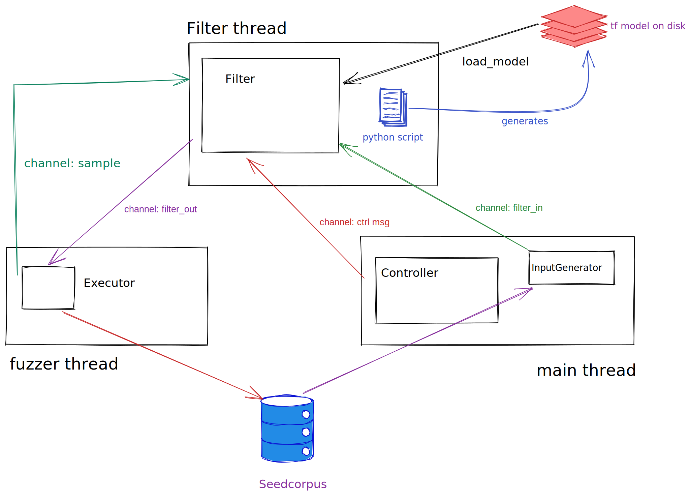

# Structure

- generator: generates inputs and input-observation pairs for the filter
- filter: Wrapper for ML model
- controller: serve as the main extry and controls connection btw generator, filter and executor,
- executor: Runs the target function 

# TODO

- [ ] Controller interface
- [ ] implementation of `InputGenerator`, maybe base on `libafl`'s `CorpusScheduler`.
- [ ] implementation of `SampleGenerator`, maybe base on `libafl`'s `StdFuzzer`.

